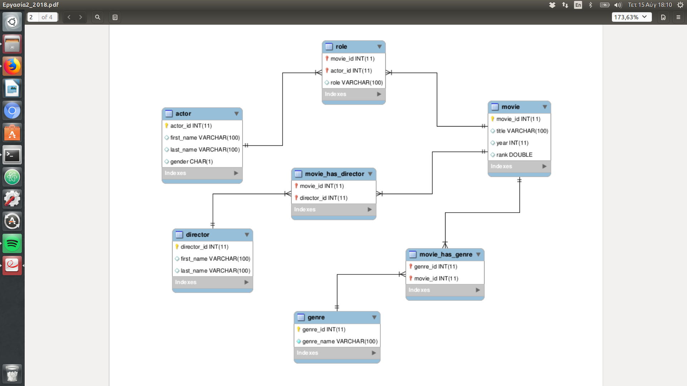

This is a project that was assigned to me during my Designing and Using Databases.
It includes 10 queries in a movie database.Each one of them is described with a comment above it.

All of them produce the right results since they were checked by a script that validates whether they are right or wrong.

Information Schema for this database:

